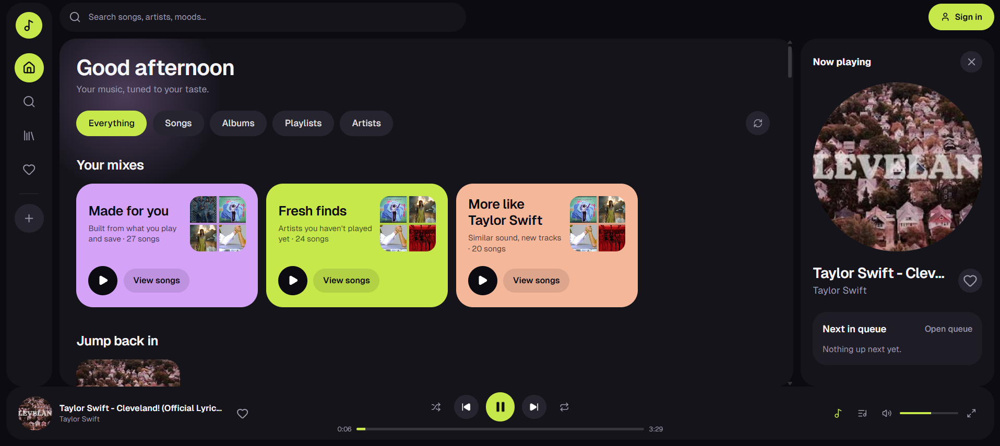

# Geekify

Geekify is a full-stack music streaming project built as a learning and development project.

The app lets users search for music, browse artists, albums and playlists, play tracks, manage favourites, and get recommendations based on their listening activity.

The frontend is built with **Next.js**, while the backend uses **FastAPI**. Music metadata and related-track information come from YouTube Music through its InnerTube API. Audio streams are resolved by the backend and proxied to the browser rather than exposing the resolved Google CDN URL directly.

## Preview



The home screen brings together music discovery, personalised mixes, listening history and playback controls. The player stays accessible while browsing the app.

## Features

* Search for songs, albums, artists and playlists
* Browse YouTube Music content
* Audio playback with seeking
* Related tracks and autoplay
* Recently played history
* Favourites and playlists
* Personalised mixes based on listening activity
* Guest mode with local storage
* Optional account-based synchronisation
* Firebase Authentication
* Firestore synchronisation
* Keyboard controls
* Responsive music player
* Backend caching for frequently requested data

## Tech Stack

### Frontend

* Next.js
* React
* TypeScript
* CSS
* Firebase Authentication

### Backend

* Python
* FastAPI
* YouTube Music InnerTube
* yt-dlp
* In-memory caching

### Cloud Services

* Firebase Authentication
* Cloud Firestore

## How It Works

Geekify has two main applications: a Next.js frontend and a FastAPI backend.

```text
                    Geekify
                       |
              +--------+--------+
              |                 |
          Next.js             FastAPI
          Frontend            Backend
              |                 |
              |        +--------+--------+
              |        |        |        |
              |    InnerTube  yt-dlp   Cache
              |        |        |
              |        +----+---+
              |             |
              +------ API / Audio
```

The browser communicates with Next.js, which forwards API requests to FastAPI.

For playback, the backend resolves an available audio stream and proxies the audio data to the frontend. This keeps the resolved Google CDN URL on the server side.

## Running Locally

Geekify requires two processes:

* FastAPI backend on port `8000`
* Next.js frontend on port `3000`

### 1. Start the backend

Navigate to the backend directory and create a virtual environment:

```bash
cd backend
python -m venv .venv
```

On Windows, activate it with:

```powershell
.venv\Scripts\activate
```

Install the dependencies:

```bash
pip install -r requirements.txt
```

Start FastAPI:

```bash
uvicorn app.main:app --reload --host 127.0.0.1 --port 8000
```

### 2. Start the frontend

Open another terminal:

```bash
cd frontend
npm install
npm run dev
```

Open http://localhost:3000 in your browser.

## API

| Method | Endpoint                     | Description                                |
| ------ | ---------------------------- | ------------------------------------------ |
| GET    | `/api/search?q=&type=`       | Search songs, albums, artists or playlists |
| GET    | `/api/track/{videoId}`       | Get track metadata                         |
| GET    | `/api/stream/{videoId}`      | Stream audio                               |
| GET    | `/api/related/{videoId}`     | Get related tracks                         |
| GET    | `/api/artist/{channelId}`    | Get artist information                     |
| GET    | `/api/album/{playlistId}`    | Get album information                      |
| GET    | `/api/playlist/{playlistId}` | Get playlist information                   |
| GET    | `/api/home?seed=`            | Get the home feed                          |
| GET    | `/api/prewarm/{videoId}`     | Resolve and cache a stream before playback |
| POST   | `/api/recommend/mix`         | Generate personalised mixes                |
| GET    | `/api/health`                | Check backend availability                 |

Audio stream URLs are cached for approximately five hours. Search and browse responses are cached for approximately fifteen minutes.

The home feed is reshuffled when requested so the same cached content does not always appear in the same order.

## Recommendations

The recommendation system is implemented in:

`backend/app/services/recommender.py`

It uses listening history and YouTube Music's related-track results. It does not use a machine-learning model or a separate recommendation database.

### 1. Selecting seeds

Favourite and recently played tracks are used as recommendation seeds. Favourites receive more weight, while newer listening activity receives a higher weight. The system also limits how many seeds come from the same artist.

### 2. Finding candidates

The backend requests related tracks from YouTube Music for each selected seed. These tracks become candidates for the recommendation system.

### 3. Scoring

Candidates are ranked using factors such as:

* The weight of the seed track
* The position of a track in related-track results
* Whether multiple seeds suggest the same track
* Familiarity with the artist

Previously played tracks are filtered out where possible.

### 4. Diversity

The final results are re-ranked to reduce repetition from the same artist.

### 5. Available mixes

The recommendation system produces mixes such as:

* **Made for you** — based on favourites and listening history
* **Fresh finds** — tracks from artists the user has not played
* **More like `<artist>`** — tracks related to a particular artist

Guest users can also receive recommendations using locally stored listening history.

## Accounts

Accounts are optional. Geekify can use Firebase for:

* Email/password authentication
* Google authentication
* Favourite synchronisation
* Playlist synchronisation
* Listening-history synchronisation

Without Firebase configuration, the application can be used in guest mode.

### Firebase Setup

1. Open the [Firebase Console](https://console.firebase.google.com) and create a project.
2. Add a Web application and copy its configuration.
3. Enable Email/Password and Google sign-in under Authentication.
4. Create a Firestore database.
5. Add the rules from `firestore.rules` to the Firestore Rules tab and publish them.
6. Configure the frontend environment variables.

Example configuration:

```dotenv
NEXT_PUBLIC_FIREBASE_API_KEY=...
NEXT_PUBLIC_FIREBASE_AUTH_DOMAIN=your-project.firebaseapp.com
NEXT_PUBLIC_FIREBASE_PROJECT_ID=your-project
NEXT_PUBLIC_FIREBASE_APP_ID=...
```

Place these variables in `frontend/.env.local` for local development, or configure them in your deployment platform.

### Data Synchronisation

Guest data is stored locally. When a user signs in for the first time on a device, local data is merged into the account. Subsequent changes are synchronised with Firestore.

Signing out clears local data from that device, according to the application's current synchronisation behaviour.

## Keyboard Controls

| Key     | Action          |
| ------- | --------------- |
| `Space` | Play or pause   |
| `←`     | Seek backward   |
| `→`     | Seek forward    |
| `↑`     | Increase volume |
| `↓`     | Decrease volume |

## Configuration

| Variable                 | Location | Purpose                        |
| ------------------------ | -------- | ------------------------------ |
| `NEXT_PUBLIC_API_URL`    | Frontend | Backend URL                    |
| `YOUTUBE_COOKIES_PATH`   | Backend  | Path to cookies used by yt-dlp |
| `YOUTUBE_COOKIES`        | Backend  | Cookie data for yt-dlp         |
| `YOUTUBE_COOKIES_BASE64` | Backend  | Base64-encoded cookie data     |

If `NEXT_PUBLIC_API_URL` is not provided, the frontend uses its default backend configuration.

YouTube may challenge requests from some cloud or datacenter IP addresses. Cookies may help with certain yt-dlp playback failures.

## Troubleshooting

### Playback does not work

Update yt-dlp:

```bash
pip install -U yt-dlp
```

Changes to YouTube can affect stream resolution, so an older yt-dlp version may stop working for some tracks.

If requests are being challenged on a cloud deployment, check the backend logs and configure the optional cookie variables if appropriate.

### Search or Home is empty

Check the FastAPI terminal for errors. Verify that the backend is running and that the frontend is configured to reach it.

### Backend is not responding

Start the backend:

```bash
uvicorn app.main:app --reload --host 127.0.0.1 --port 8000
```

Then check the health endpoint at:

`http://127.0.0.1:8000/api/health`

## Project Structure

```text
Geekify/
├── assets/
│   └── geekify-home.png
├── backend/
│   ├── app/
│   │   ├── routes/
│   │   ├── services/
│   │   └── main.py
│   ├── requirements.txt
│   └── ...
├── frontend/
│   ├── app/
│   ├── components/
│   ├── lib/
│   └── ...
├── firestore.rules
└── README.md
```

## Current Limitations

* Playback depends on YouTube service availability and behaviour.
* Resolved stream URLs are temporary.
* Some cloud IP addresses may be challenged.
* yt-dlp may require updates when YouTube changes its implementation.
* Recommendation quality depends on available listening history and related-track results.
* Guest data is stored locally and is not automatically shared across devices.

## Future Improvements

* Improve recommendation quality
* Make stream resolution more reliable
* Improve error handling
* Add more playback options
* Refine mobile controls
* Expand automated test coverage
* Improve caching and offline handling

## Disclaimer

Geekify is a personal educational software project. It does not host music files itself. Music metadata and playback availability depend on third-party services. Users are responsible for complying with applicable terms and laws when using the application.
